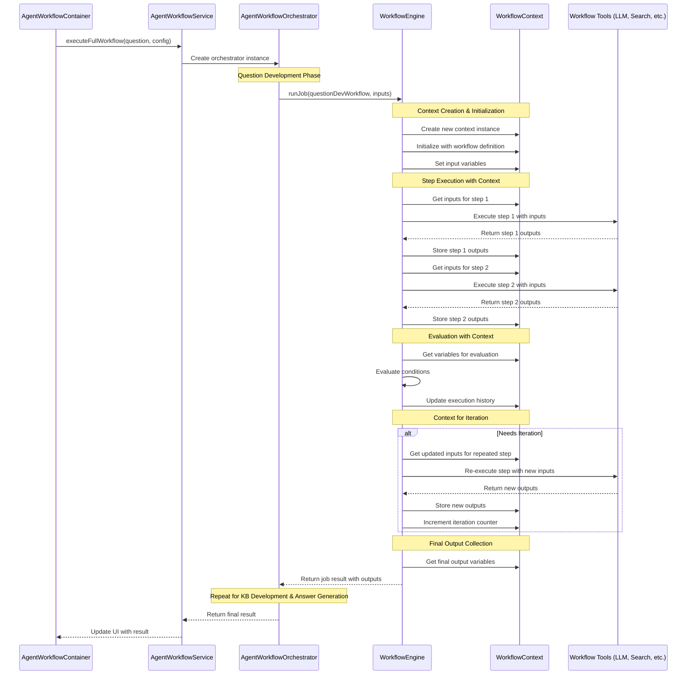
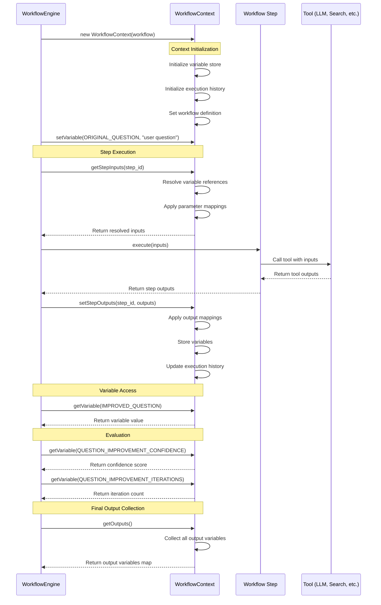
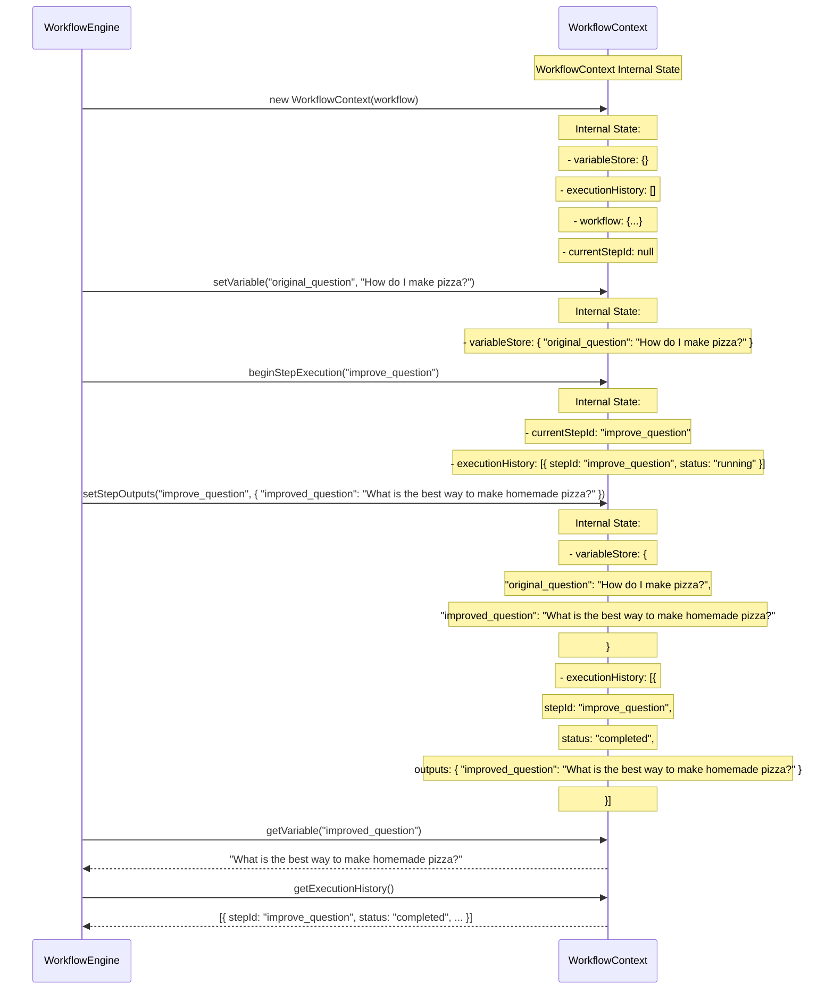
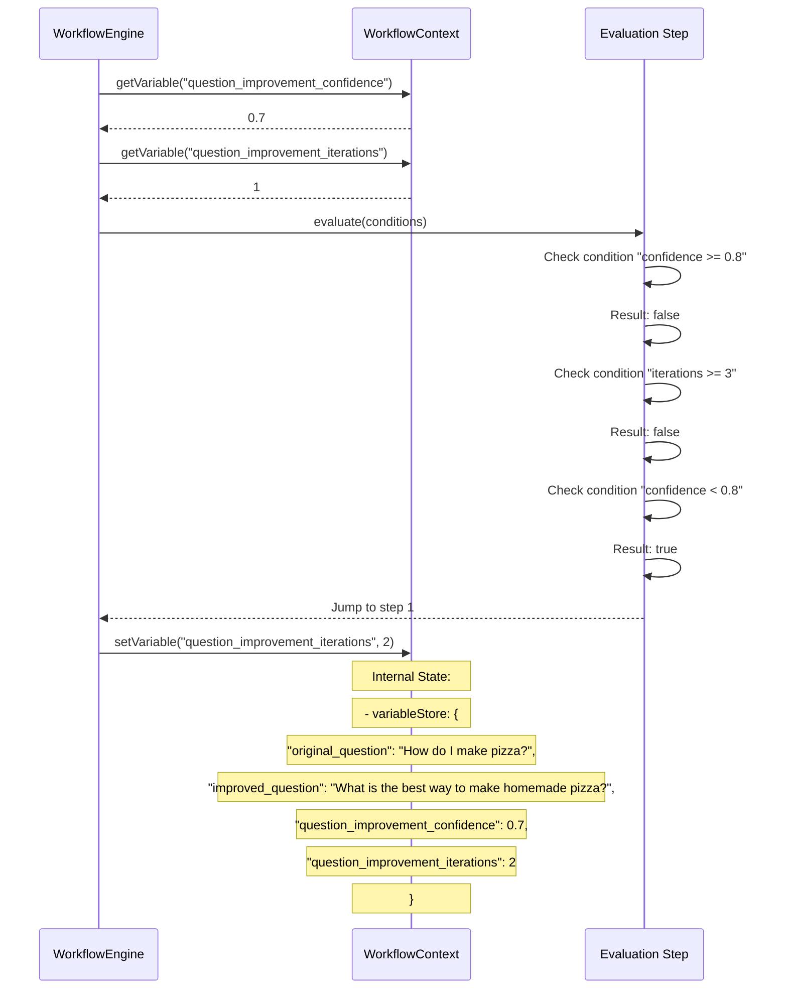

# WorkflowContext Interaction in Agent Workflow System

This document illustrates how WorkflowContext fits into the agent workflow system architecture, focusing on its interactions with other components.

## WorkflowContext in the Overall Architecture

## Detailed WorkflowContext Interaction

## WorkflowContext State Management

## WorkflowContext in Evaluation Steps

## Key Responsibilities of WorkflowContext

1. **Variable Storage and Retrieval**
   - Stores all workflow variables (inputs, outputs, intermediate values)
   - Provides methods to get and set variables by name
   - Handles type conversion and validation

2. **Execution History Tracking**
   - Records which steps have executed and their results
   - Tracks iteration counts for loops
   - Maintains a log of the workflow execution path

3. **Step Input/Output Management**
   - Resolves input parameters for each step based on parameter mappings
   - Stores step outputs and applies output mappings to workflow variables
   - Handles variable substitution in templates (e.g., for LLM prompts)

4. **State Persistence**
   - Can serialize its state for persistence (if needed)
   - Can be restored from a serialized state to resume execution

5. **Workflow Definition Access**
   - Provides access to the workflow definition
   - Allows steps to reference workflow metadata

The WorkflowContext is essentially the "memory" of the workflow execution, ensuring that data flows correctly between steps and that the workflow state is maintained throughout the execution process. 